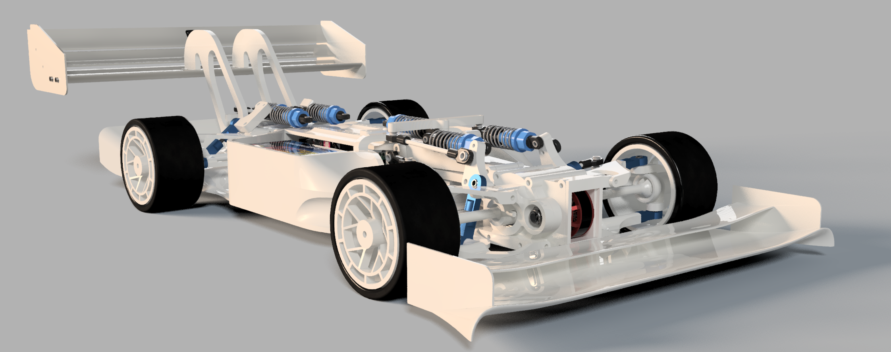

# High-Performance RC Car Project

## Overview
An advanced electric vehicle platform featuring torque vectoring, high-speed capabilities (200+ km/h), and comprehensive sensor integration (some features still under development). Built using the ESP-IDF v5.4 toolchain with C++, this project combines sophisticated hardware control with real-time telemetry and sensor fusion.


<p align="center">
  
  
</p>


## Background
Back in early 2024, we stumbled upon a YouTube video series from [@IndeterminateDesign](https://www.youtube.com/playlist?list=PLtkERGXE-7yYSD-6eVEBmZx3pTgSMK7Pk) showcasing their hypercar RC project. Like many ambitious projects, it started with that naive thought of "hey, we can do that but better!" Now, a year later(as of February 2025), after working on-and-off around school commitments, our RC car is just about ready to move under its own power.

Our approach focused on using cost-effective electronics and sensors and that when it would inevidbly come back to bite us we would be able to solve it "*in software*".

## Getting Started

### Prerequisites
- ESP-IDF v5.4 or newer
- C++ compiler supporting C++17
- CMake 3.16+
- Git with LFS support
- Python 3.8+

### Installation

1. Clone the repository with submodules:
```bash
git clone --recursive <link>
cd <directory>
git submodule update --init --recursive
```

2. Configure the build:
```bash
idf.py set-target esp32s3
idf.py menuconfig
```

3. Build and flash:
```bash
idf.py build
idf.py -p [PORT] flash monitor
```

### Project Structure
```
├── components/
│   ├── drivers/        # Hardware interface drivers
│   ├── sensors/        # Sensor integration modules
│   └── vehicle/        # Vehicle control systems
├── main/               # Application entry point
└── docs/               # Lol
```

---

## Implementation Details

### Hardware Specifications

#### Core Components
- ESP32-S3 microcontroller
- Four 2300KV BLDC motors (one per wheel)
- 32-bit ESCs running BLHeli32/AM32 firmware
  - Bidirectional DSHOT protocol support
  - Sinusoidal drive capabilities
- ~750W per wheel (~1hp/wheel)
- Total vehicle weight: ~2-2.5kg

#### Sensor Suite
- BN220T GPS module
- ICM20948 9-axis IMU
  - Accelerometer, gyroscope, magnetometer
- FrSky SBUS 16-channel receiver
- Per-wheel telemetry via bidirectional DSHOT

### Sensor Integration

#### Motion & Position Data
- GPS: Speed, location, time
- IMU:
  - Raw and calibrated gyroscope data
  - Raw and linear acceleration
  - 6-axis quaternions (orientation from accelerometer and gyroscope)
  - 9-axis quaternions (fusion with magnetometer for absolute orientation)
  - Advanced motion processing

#### Motor Telemetry (per wheel)
- Real-time RPM monitoring
- Current consumption
- ESC temperature
- Control signal verification

### Development Journey

This project represents over 1000 hours of combined development effort, though not all of this time is reflected in the final implementation. Many hours were invested in exploring various approaches and debugging hardware interfaces. These "dead ends" proved to be valuable learning opportunities, particularly in areas like:
- UART and SPI peripheral integration without ready-made libraries
- Custom DSHOT driver development (initially without oscilloscope access)
- Creative use of a second ESP32 as a makeshift logic analyzer
- Hardware integration challenges and solutions

### Timeline
- Early 2024: Project inception, inspired by IndeterminateDesign's hypercar series
- Spring 2024: Initial CAD design and prototype development
- Summer 2024: First iteration of physical components, design validation
- Autumn/Winter 2024: CAD design finalization (excluding body)
- Winter 2024: Hardware assembly and integration
- New Year 2024/25: Software development initiation
- February 1, 2025: Sensor and architecture implementation
- February 16, 2025: Basic RC control achievement (steering and motor control)

## Authors and Acknowledgments

### Project Team
- **Aron Cullberg**
  - Leading software development and hardware integration
  - Implemented sensor fusion and control systems
  - Developed custom DSHOT driver implementation
- **Viktor Hajto**
  - Leading mechanical design and CAD development
  - Managed hardware assembly and optimization
  - Designed and implemented physical components

### Additional Acknowledgments
- Jonathan Vestin for perspective on FPGA programming challenges and assistance with university 3D printing resources
- IndeterminateDesign for inspiration through their hypercar project
- Claude 3.5 Sonnet for development assistance
<!-- - Open-source community contributors -->
<!-- - Various repository maintainers whose work contributed to this project -->