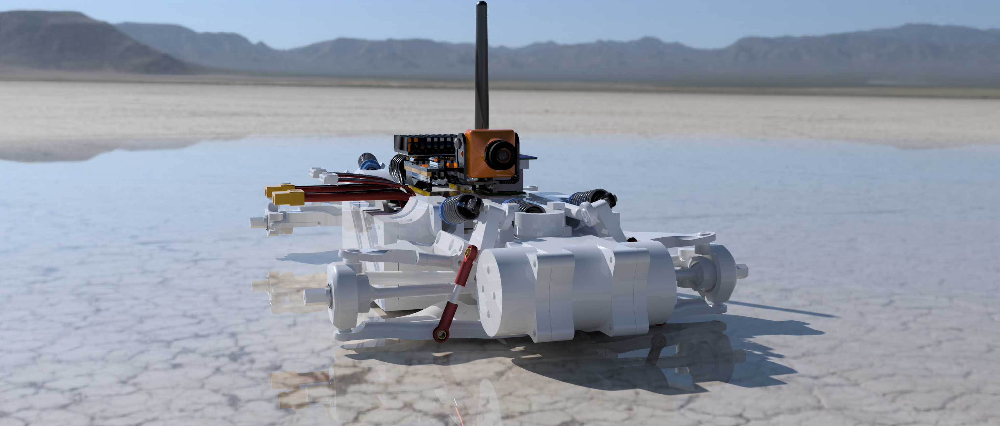
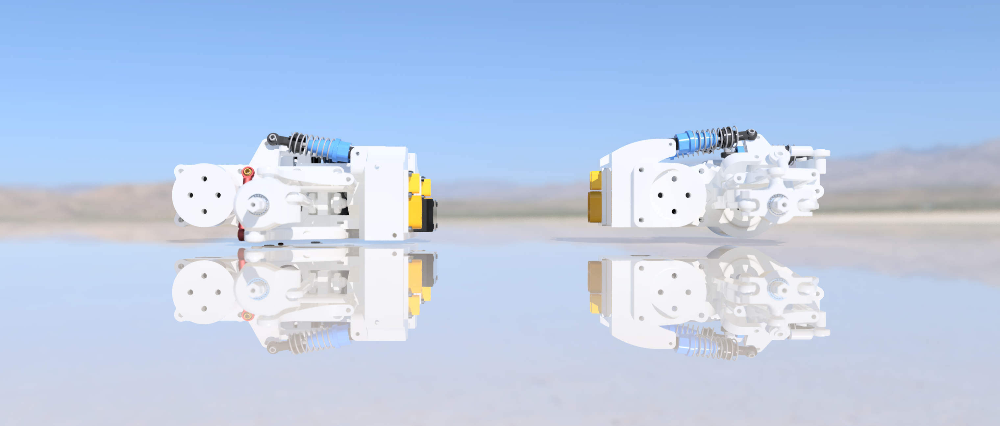
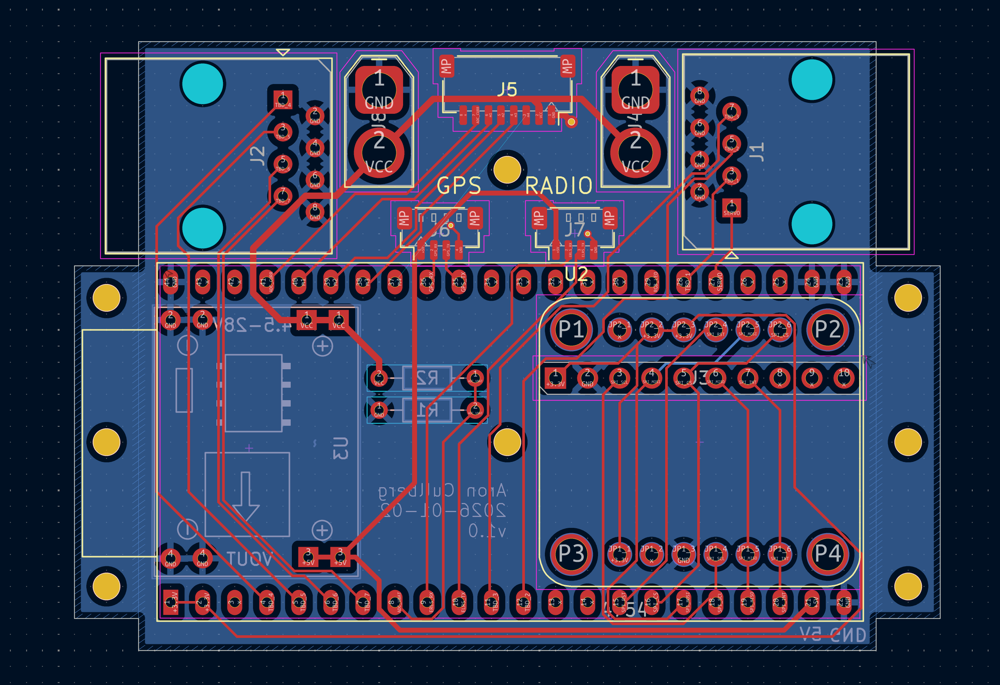
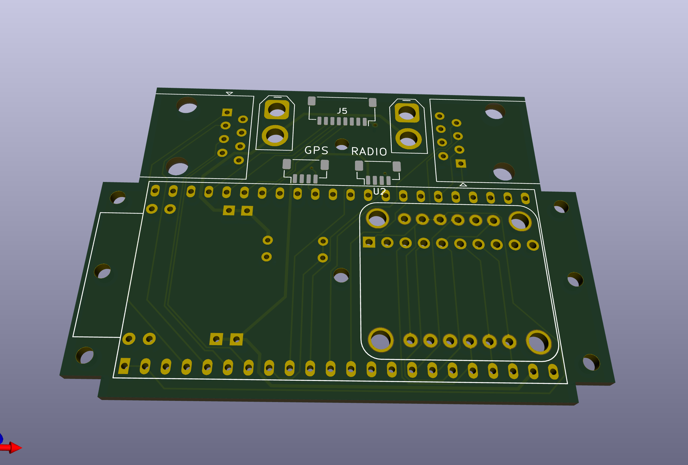
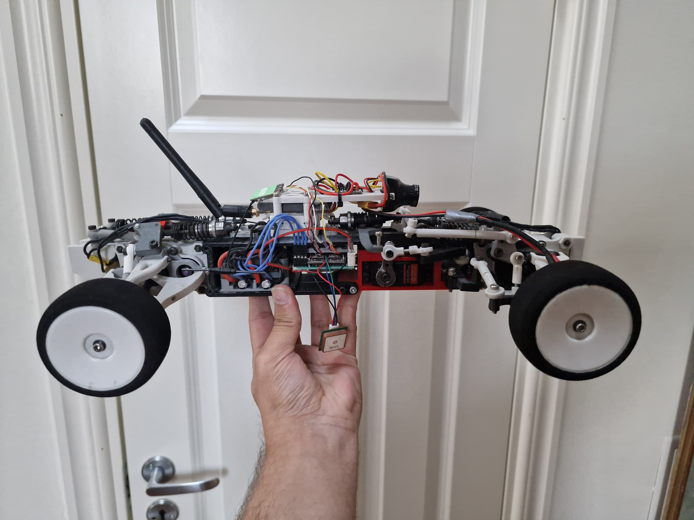

# 1/10 Scale RC Car with Computer-Assisted Control

A custom-built RC car platform using an ESP32-S3 as an intermediary between driver input and hardware, designed as a testbed for experimenting with torque vectoring, autonomous navigation, and other stuff.

---

## Current Build (v2)

  
  

https://github.com/user-attachments/assets/fe65e64a-15ae-4bb7-b17b-789cece0033f

  
  

### Why v2?

v1 was hard to maintain/replace broken gears, and it turns out that module 0.8mm gears made of plastic does not enjoy meshing at 50k rpm.

## Features

**Implemented**
- PID-regulated rate-of-change steering (replacing proportional steering)
- Bidirectional motor control, and rpm feedback per motor/wheel via DSHOT protocol
- 9-axis IMU integration over SPI
- GPS and RC link over UART
- Servo control via MCPWM

**In Development**
- GPS waypoint navigation

**Maybe in future**
- Torque vectoring
- LIDAR integration (if we can get cheap one from china that meets specs)

---

## Software Architecture

### Real-Time Control System
A 100Hz control loop coordinates all vehicle systems - reading RC inputs, processing sensor data, and commanding motors with consistent timing. The architecture uses FreeRTOS tasks pinned to specific cores, with thread-safe singleton patterns for shared resources.

### RC Link Abstraction
The RC system auto-detects the connected receiver protocol (SBUS or ExpressLRS/CRSF) at startup, providing a unified interface regardless of hardware. Bidirectional telemetry pushes vehicle data (GPS position, IMU attitude, battery state, motor RPM) back to the transmitter in real-time.

### Sensor Integration
Each sensor subsystem (GPS, IMU, voltage monitor) runs independently and exposes thread-safe getters. The IMU provides per-report callbacks at 100Hz, while GPS updates flow through a NMEA parser. All data is accessible from any task without blocking.

### Component Design
The codebase follows ESP-IDF component conventions - self-contained modules with clean interfaces that can be composed together. Protocol drivers (CRSF, SBUS, NMEA) are separate from the abstractions that use them.

---

## Managed Components

External ESP-IDF components used in this project:

| Component | Description | Notes |
|-----------|-------------|-------|
| [aroncullberg/ESP_CRSF](https://github.com/aroncullberg/ESP_CRSF) | CRSF/ELRS protocol driver | Fork - added telemetry types (airspeed, flight mode, temp, RPM) and improved failsafe handling |
| [aroncullberg/EscDriver](https://github.com/aroncullberg/EscDriver) | DSHOT motor control driver | Fork - modified arming behaviour for this project's use case |
| [andyfinity/TinyGPSPlus-ESPIDF](https://github.com/andyfinity/TinyGPSPlus-ESPIDF) | NMEA GPS parser | |
| [espressif/led_strip](https://components.espressif.com/components/espressif/led_strip) | WS2812 LED driver | Espressif official component |
| [myles-parfeniuk/esp32_BNO08x](https://github.com/myles-parfeniuk/esp32_BNO08x) | BNO08x IMU driver | |

---

## Demo

https://github.com/user-attachments/assets/290ff5f4-501e-493e-9871-947214888d34

https://github.com/user-attachments/assets/98f6a3cb-3de6-45b8-ba74-e7486755f528

https://github.com/user-attachments/assets/8f9d8ff1-3977-4885-bc6d-ea8ea9b9fe95

https://github.com/user-attachments/assets/9d515676-ec9a-4bec-ab3a-135b9c511faa

---

## Gallery

### v1

  
  

  
  

---

## Team

- **Aron Cullberg**
- **Viktor Hajto**
