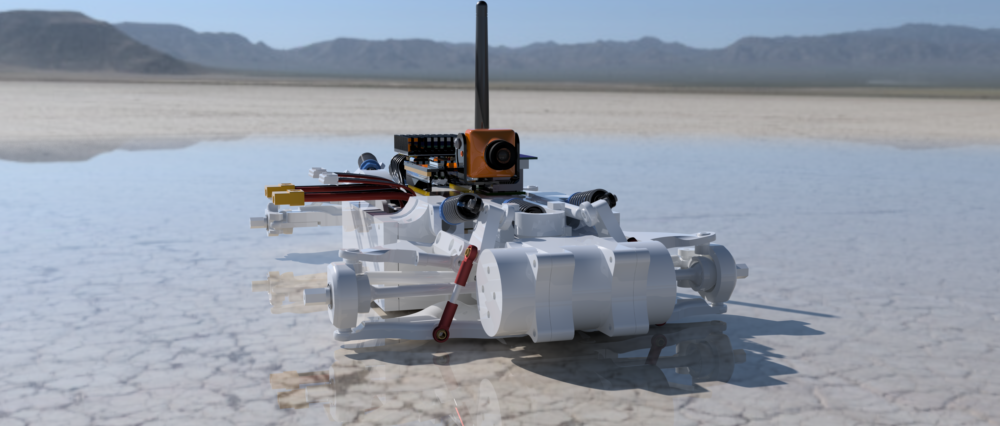
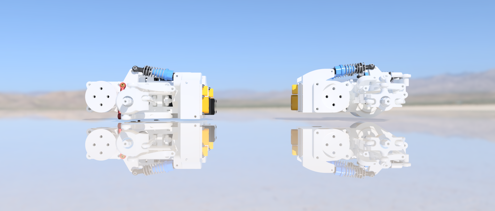
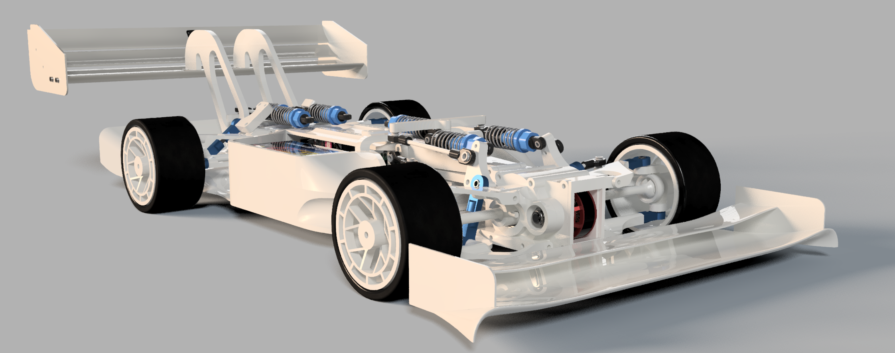

# 1/10 Scale RC Car with Computer-Assisted Control

A custom-built RC car platform using an ESP32-S3 as an intermediary between driver input and hardware — designed as a testbed for experimenting with torque vectoring, autonomous navigation, and advanced vehicle dynamics.

> **Note:** This repo serves as a development log for our own reference. We won't be providing support for reproducing the project.

---

## Current Build (v2)

<!-- Replace with your v2 hero image -->

  
  

### Why v2?

v1 was hard to maintain/replace broken gears, and it turns out that module 0.8mm gears made of plastic does not enjoy meshing at 50k rpm.

## Features

**Implemented**
- PID-regulated rate-of-change steering (replacing proportional steering)
- Bidirectional motor control, and rpm feedback per motor/wheel via DSHOT protocol
- 9-axis IMU integration over SPI
- GPS and RC link over UART
- Servo control via MCPWM

**In Development**
- GPS waypoint navigation

**Maybe in future**
- Torque vectoring
- LIDAR integration (if we can get cheap one from china that meets specs)

---

## Demo

<!-- Add your video links here -->
https://github.com/user-attachments/assets/70d1ed36-8229-4bed-bc21-50745e4e3fcc

https://github.com/user-attachments/assets/9d515676-ec9a-4bec-ab3a-135b9c511faa

https://github.com/user-attachments/assets/2ce086a1-ba34-4368-8fec-eeab37d5dc80

---

## Gallery

### v2

  <!-- Add v2 build photos here -->
  
  

### v1

  
  

  
  

---

## Team

- **Aron Cullberg**
- **Viktor Hajto**
